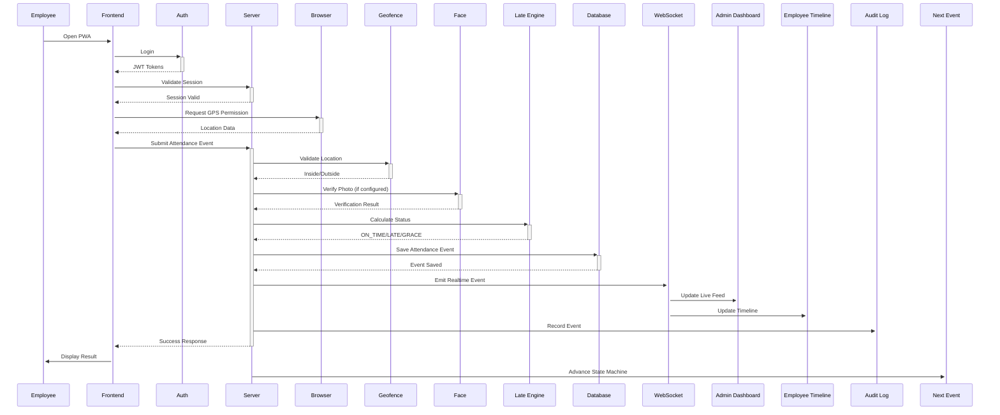

# Attendance Flow



## Event State Machine
```
NOT_STARTED → LOGIN_PENDING → LOGGED_IN → LUNCH_OUT → LUNCH_IN → TEA_OUT → TEA_IN → SIGN_OUT → COMPLETED
```

Each transition requires the previous event to be completed. Invalid transitions return a clear error message.
