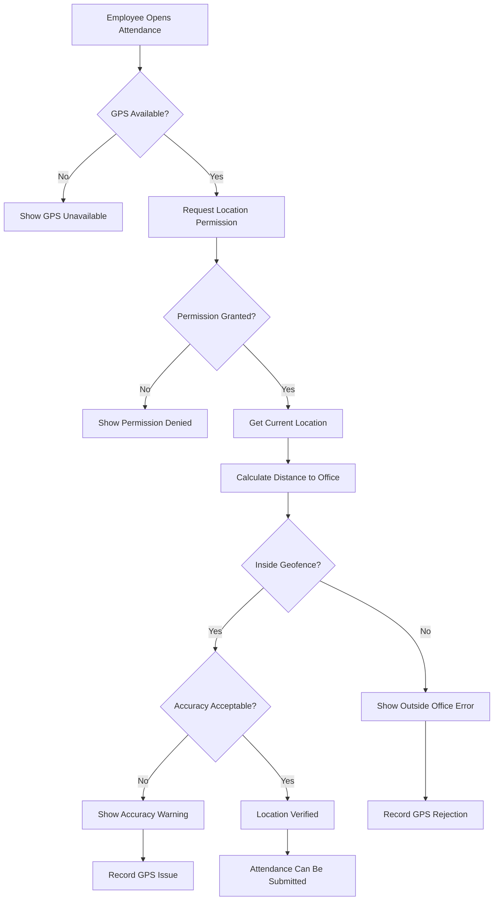

# GPS Validation Flow

## Accuracy Validation
- Compare GPS accuracy against configured threshold
- If accuracy > threshold, mark as INACCURATE
- Distance from office center vs geofence radius
- Both conditions must be met for VERIFIED status
